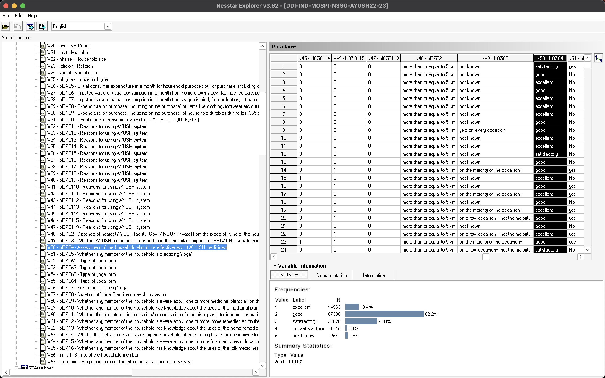

# nsso-ayush


## Hyperlinks
- https://microdata.gov.in/NADA43/index.php/catalog/219/


# Dataset


## Cleaned Dataset

Cleaned dataset in full is available as `.parquet` files inside the `data/` directory.

```bash
$ ls -lh data/*.parquet
-rw-r--r--@ 1 bkowshik  staff   3.5M Dec 25 14:04 data/79AyushHH.parquet
-rw-r--r--@ 1 bkowshik  staff   6.5M Dec 25 14:04 data/79Ayushper.parquet
```

For a quick scan, `100 rows` from both of these files is available in `.csv` format inside the `data/` directory.

```bash
$ ls -lh data/*.csv
-rw-r--r--@ 1 bkowshik  staff    21K Dec 25 14:10 data/79AyushHH-sample.csv
-rw-r--r--@ 1 bkowshik  staff    27K Dec 25 14:10 data/79Ayushper-sample.csv
```

Description of the columns is available in the file `data/[dataset]-columns.csv`.

```bash
$ ls -lh data/*-columns.csv
-rw-r--r--@ 1 bkowshik  staff   3.6K Dec 25 13:42 data/79AyushHH-columns.csv
-rw-r--r--@ 1 bkowshik  staff    11K Dec 25 13:42 data/79Ayushper-columns.csv
```


## Nesstar

Reference: `DDI-IND-MOSPI-NSSO-AYUSH22-23`

> Nesstar is a platform for data publishing, exploration, and analysis, often used for managing social science research data. Unfortunately, Nesstar does not have a direct Python SDK or library.

This dataset is published using Nesstar and the downloaded Microdata has the following files.

```bash
$ ls -lh
total 493296
-rw-rw-rw-@ 1 bkowshik  staff   237M  9 Dec 15:22 DDI-IND-MOSPI-NSSO-AYUSH22-23.Nesstar
-rw-rw-rw-@ 1 bkowshik  staff   1.0M 11 Nov 15:38 Guide to dowdload microdata.pdf
-rwxrwxrwx@ 1 bkowshik  staff   2.5M 11 Nov 15:38 NesstarExplorerInstaller.exe
```

## Apple Mac Setup

Using the following steps, I got Nesstar Explorer working on Apple MacBook Pro M2.

```bash
# Install stable version of wine.
$ brew install --cask --no-quarantine wine-stable

# Install Rosetta.
$ softwareupdate --install-rosetta --agree-to-license

# Install gstreamer.
$ brew install --cask gstreamer-development
```

Finally, open `wine-stable` from Spotlight on Mac and select the `.Nesstar` file to open in Nesstar Explorer. 🎉

_NOTE: Nesstar Explorer supports exporting the dataset in tab-delimited format._


