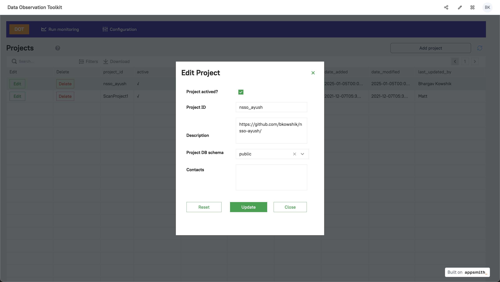
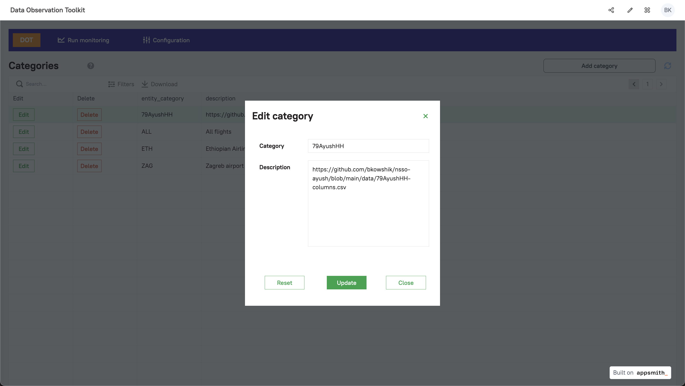
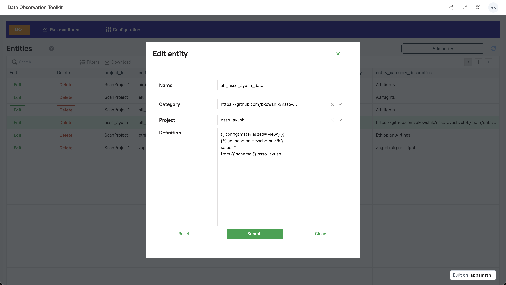
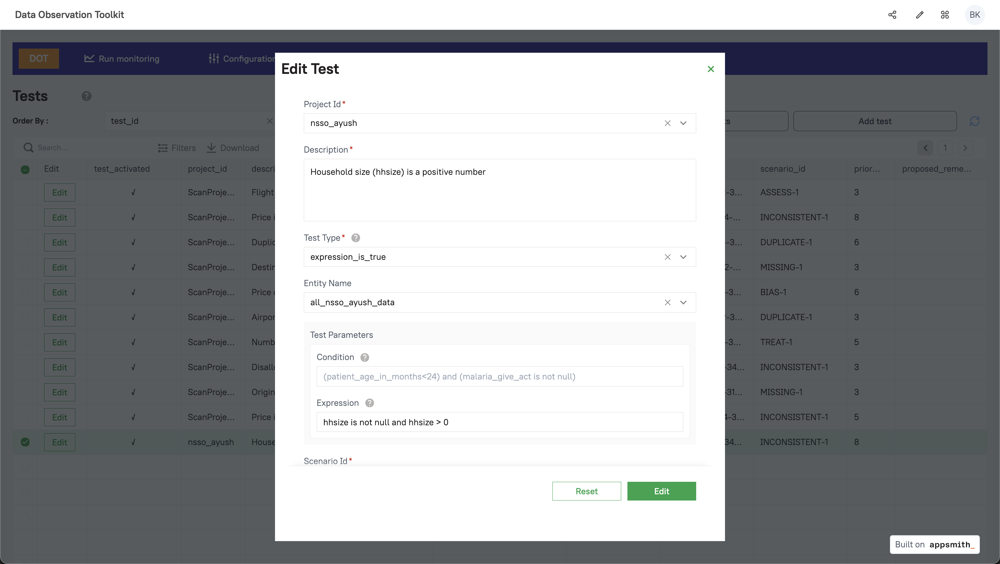
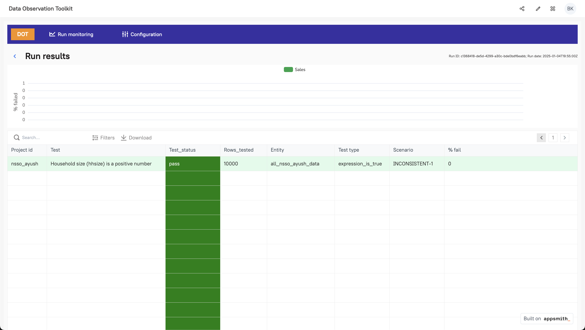

# Data Observation Toolkit (DOT)

Ref: https://github.com/datakind/Data-Observation-Toolkit/

> The Data Observation Toolkit (DOT) can be used to monitor data in order to flag problems with data integrity and scenarios that might need attention.

## Workflow

1. Load nsso-ayush dataset into `nsso_ayush` table in Postgres using the Jupyter notebook `nsso-ayush/nbs/03_dot.ipynb`
2. Using the appsmith UI of DOT, setup the required configurations.

### Create Project: `nsso_ayush`



### Create Category: `79AyushHH`




### Create Entity: `all_nsso_ayush_data`

```sql
{{ config(materialized='view') }}

select *
from {{ schema }}.nsso_ayush
```




### Create Test: `hhsize > 0`




3. Add database connection details in the configuration file.

```yaml
nsso_ayush_db:
  type: postgres
  host: dot_db
  user: postgres
  pass: "{{ env_var('POSTGRES_PASSWORD') }}"
  port: 5432
  dbname: dot_db
  schema: public
  threads: 4
```

4. Update `column_name` of newly created test because of https://github.com/datakind/Data-Observation-Toolkit/issues/89 [Temporary]

```sql
update dot.configured_tests
set column_name = ''
where test_id = '842e0a0a-d746-3015-a998-8b9033e40755';
```

5. Finally, run the tests (just one for now) in the project.

```bash
python3 ./run_everything.py --project_id 'nsso_ayush'
```

